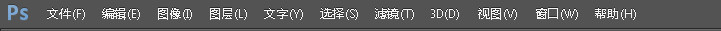
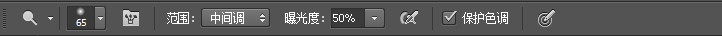
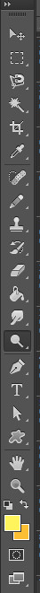
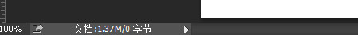
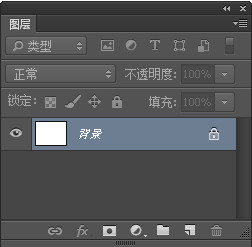
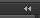
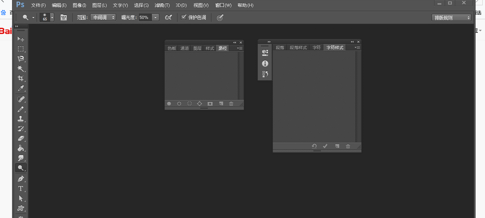

# 用户界面  
## 一、介绍
用户界面包括菜单栏，工具栏，选项栏，舞台和面板。  

## 二、位置
* 菜单栏  
菜单栏在用户界面的最上方，它提供了许多功能的菜单选项。  

* 选项栏  
选项栏在菜单栏的下方，随着选择的工具不同，它的选项会发生改变。它的作用是用于设置当前工具的相关配置。 
  
* 工具栏  
工具栏在界面的最左边，它用于选择应用于各种工作的工具。  
 
* 舞台  
舞台在界面的中央，白色的部分是表示工作区：图片的区域。  
  
在舞台的下方有一个很小的信息栏，它用于显示或者设置当前缩放比例和文档大小、配置文件等信息。  
 
* 面板  
面板就是页面中许多小窗口，它们的功能多种多样，每个面板都有各自特定的功能。以下以图层面板为例。  
  

## 三、面板的展开和组合
按面板的双箭头图标可以展开或折叠面板。    
面板可以随意拖拽放置和组合，在将面板拖拽置视图左边边缘或者另一面板的选项位置、下方边缘和左方边缘，出现蓝色线时，可以组合放置面板。
> 注意：是鼠标接触到边缘而不是面板边缘接触边缘才会出现蓝线。  
