# 移动工具
-------
### 一、介绍
移动工具对应工具栏中的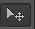图标，它用于移动选中的区域获取选中图层的内容。
### 二、解除图层锁定
当使用ps打开一张图片时，图层默认为被锁定的背景。这样是不能使用移动工具移动背景的，需要吧背景解锁。解锁的方式是在图层面板中将图层右侧的锁拉到下侧的垃圾桶图标。过程如下图：  
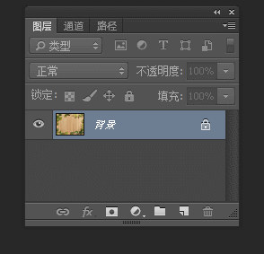   
而给图层加锁的方式就是选中对应图层，点击图层面板中的锁图标。如下图：  
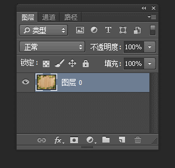
### 三、移动图层内容
在图层栏中选中对应图层，选择移动工具，在舞台中移动即可，它移动图层中所有的内容。如下图：  
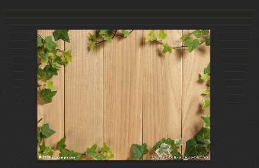  
不过，移动工具可以自动选择元素所在的图层，这样，就不用手动选择图层了。使用过程如下：
1. 勾选选项栏中的自动选择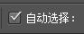
2. 点击或者拉取需要移动的内容。
注意观察图中选中情况的变化：

### 四、移动选中内容
移动工具可以只移动选择工具选中的部分。需要注意的是，移动后会导致原图“缺”了一部分，所以，如果不希望影响原图，最后新建一个图层进行移动操作。
1. 不拷贝图层，在原图操作  
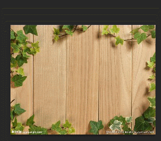
2. 拷贝图层，在新图层操作，不影响原图层  
可以按`ctrl+j` 快速拷贝当前选中图层。  
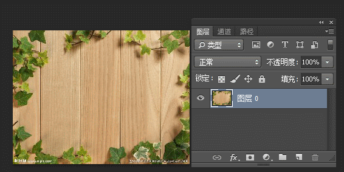
### 五、变换
勾选选项栏中的显示变换控件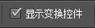，在选中图层或者选中部分会显示变换框，可以放大、缩小、旋转变换。  
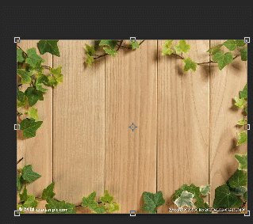  
然后，点击选项栏中右边的图标应用（勾图标）或者取消（删除图标）这次变换 
  
当然，也可以直接按回车键应用变换。
### 六、对齐
使用选项栏中的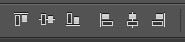，可以让图层内容相对于选区顶、底等对齐。  
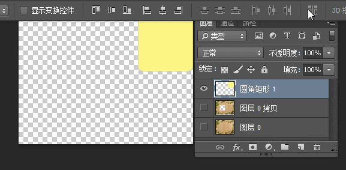
### 七、快捷方式
1. 按住`ctrl`键使用鼠标，可以快速使用移动工具；按`v`可以快速选中移动工具；
2. 选中图层后，按`ctrl+j`可以快速拷贝图层。
